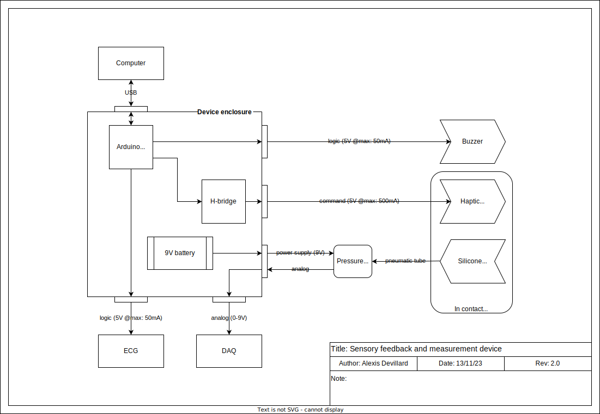
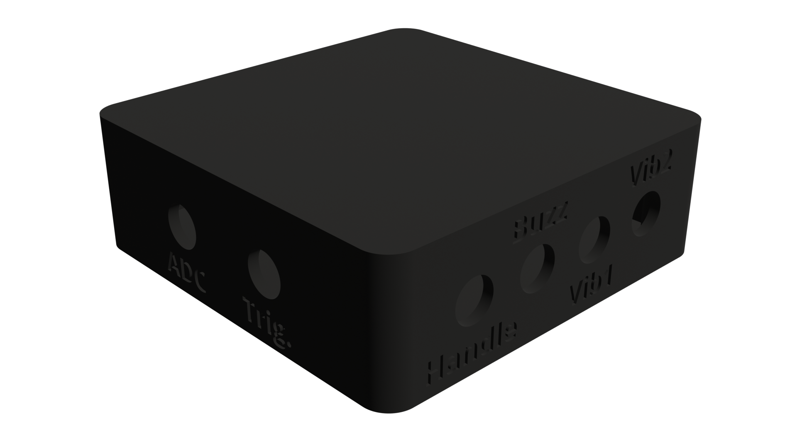

# Bsens
Simple device to trigger audio and haptic stimulus for prenatanal studies

## Hardware

### Parts


| Part | Quantity | Price | Link |
| ---- | -------- | ----- | ---- |
| Arduino Mega 2560 | 1 | £30 | [Link](https://store.arduino.cc/arduino-mega-2560-rev3) |
| H-brige -  L298N | 1 | £2 | [Link](https://www.amazon.co.uk/Driver-H-Bridge-Stepper-Controller-Arduino/dp/B07YC1GFM3/ref=sr_1_6?crid=TGY74KFTE5R9&keywords=h+bridge&qid=1702907659&sprefix=h+br%2Caps%2C50&sr=8-6) |
| LRA - VG0640001D | 1 | £2 | [Link](https://www.digikey.co.uk/en/products/detail/vybronics-inc/VG0640001D/15220805) |
| LRA - VLV101040A | 1 | £5 | [Link](https://www.digikey.co.uk/en/products/detail/vybronics-inc/VLV101040A/12323590) |
| STspin250 dev board | 1 | £15 | [Link](https://www.mikroe.com/stspin250-click) |
| Buzzer | 1 | £5 | [Link](https://www.amazon.co.uk/dp/B096ZWCG7F?psc=1&ref=ppx_yo2ov_dt_b_product_details) |
| Pressure sensor - ? | 1 | £5 | [Link](https://?) |
| GX16-5 Connector | 5 | £1.5 | [Link](https://www.amazon.co.uk/gp/product/B07WPBXX57/ref=ppx_yo_dt_b_search_asin_title?ie=UTF8&psc=1) |
| USB-B Connector | 1 | £6.5 | [Link](https://www.amazon.co.uk/gp/product/B075FVGH8H/ref=ppx_yo_dt_b_search_asin_title?ie=UTF8&psc=1) |

| Total | ~ £70 |
| ----- | ---- |


### Diagram



### 3D Model

| Name | File |
| ---- | ---- |
| Box | [Link](docs/box.stl) |
| Lid | [Link](docs/lid.stl) |



## Software

The GUI is written in Python and let you select 4 different existing experiments or open a custom one. 
You can then RUN, STOP and PAUSE the experiment. Each time a experiment is run, a new log file is created. 
The Log file contains the subject ID, the experiment name, the date and time of the experiment and the stimulus given to the subject with a timestamp.

### Experiment rule file
## Experiment Rule File

The experiment rule file is a JSON file that contains the sequence of stimuli or delays to be applied to the subject.

### Components

| Type | Description | Attributes |
| ---- | ----------- | ---------- |
| **Sequence** | A sequence of stimuli or delays | **Repeat**: number of times the sequence is repeated <br> **Content**: list of stimuli or delays |
| **stimulus** | A stimulus to be given to the subject | **Content**: list of stimuli (see below) |
| **Vib1** | A vibration stimulus | **Amplitude**: Amplitude of the vibration (0-1) <br> **Deviation**: Random uniform deviation of the amplitude |
| **Vib2** | A vibration stimulus | **Amplitude**: Amplitude of the vibration (0-1) <br> **Deviation**: Random uniform deviation of the amplitude |
| **Buzzer** | A buzzer stimulus | **Amplitude**: Amplitude of the buzzer (0-1) <br> **Tone**: Tone of the buzzer (0-1) <br> **Duration**: Duration of the buzzer (ms) <br> **Deviation**: Random uniform deviation of the duration (ms) |
| **BuzzVib2** | A combined buzzer and vibration stimulus | **Amplitude_buzz**: Amplitude of the buzz (0-1) <br> **Deviation_amplitude_buzz**: Random uniform deviation of the buzz amplitude <br> **Duration_buzz**: Duration of the buzz (ms) <br> **Tone_buzz**: Tone of the buzzer (0-1) <br> **Amplitude_vib2**: Amplitude of the vibration (0-1) <br> **Deviation_amplitude_vib2**: Random uniform deviation of the vibration amplitude |
| **Delay** | A delay between two stimuli | **Duration**: Duration of the delay (s) <br> **Deviation**: Random uniform deviation of the duration (s) |
| **Dropout_sequence** | A sequence of stimuli or delays with dropout | **Repeat**: Number of times the sequence is repeated <br> **Number_drop**: Number of dropouts in the sequence <br> **Content**: List of stimuli or delays <br> **Dropout_content**: List of stimuli or delays to be applied during the dropout |

### Example

```json
{
    "Type": "Sequence",
    "Repeat": 2,
    "Content": [
        {
            "Type": "Sequence",
            "Repeat": 2,
            "Content": [
                {
                    "Type": "stimulus",
                    "Content": [
                        {
                            "Type": "Vib2",
                            "Duration": 1,
                            "Deviation": 0
                        }
                    ]
                },
                {
                    "Type": "Delay",
                    "Duration": 2,
                    "Deviation": 0
                }
            ]
        },
        {
            "Type": "Sequence",
            "Repeat": 1,
            "Content": [
                {
                    "Type": "Sequence",
                    "Repeat": 5,
                    "Content": [
                        {
                            "Type": "stimulus",
                            "Content": [
                                {
                                    "Type": "Vib2",
                                    "Duration": 1,
                                    "Deviation": 0
                                }
                            ]
                        },
                        {
                            "Type": "Delay",
                            "Duration": 4,
                            "Deviation": 0
                        }
                    ]
                },
                {
                    "Type": "Dropout_sequence",
                    "Repeat": 5,
                    "Number_drop": 2,
                    "Content": [
                        {
                            "Type": "stimulus",
                            "Content": [
                                {
                                    "Type": "Vib2",
                                    "Duration": 1,
                                    "Deviation": 0
                                }
                            ]
                        },
                        {
                            "Type": "Delay",
                            "Duration": 1,
                            "Deviation": 0
                        }
                    ],
                    "Dropout_content": [
                        {
                            "Type": "Delay",
                            "Duration": 3,
                            "Deviation": 0
                        }
                    ]
                }
            ]
        }
    ]
}
```

## Requirements

- Python 3.x
- Tkinter library
- CustomTkinter library
- Threading module

## Setup

Ensure Python 3.x is installed on your system along with the required libraries. The GUI utilizes `tkinter` and `customtkinter` for the interface, `threading` for managing concurrent tasks, and a custom `Experiment` class from the `core.experiment` module for experiment logic.

