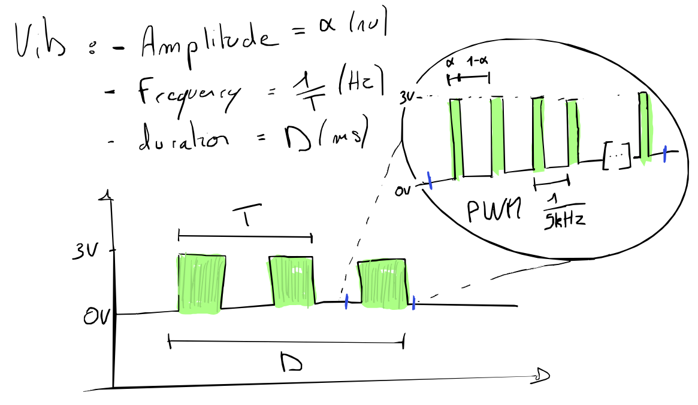
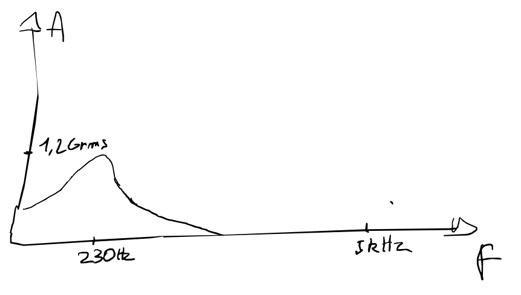

# Bsense

Simple device to trigger audio and haptic stimuli for prenatal studies.

## Hardware

### Components

| Part                  | Qty | Price | Link |
|-----------------------|-----|-------|------|
| Teensy 4.0/4.1        | 1   | £25   | [PJRC](https://www.pjrc.com/store/teensy40.html) |
| H-bridge (L298N)      | 1   | £2    | [Amazon UK](https://www.amazon.co.uk/Driver-H-Bridge-Stepper-Controller-Arduino/dp/B07YC1GFM3) |
| LRA (VG0640001D)      | 1   | £2    | [Digi-Key](https://www.digikey.co.uk/en/products/detail/vybronics-inc/VG0640001D/15220805) |
| LRA (VLV101040A)      | 1   | £5    | [Digi-Key](https://www.digikey.co.uk/en/products/detail/vybronics-inc/VLV101040A/12323590) |
| STSPIN250 dev board   | 1   | £15   | [MikroElektronika](https://www.mikroe.com/stspin250-click) |
| Buzzer                | 1   | £5    | [Amazon UK](https://www.amazon.co.uk/dp/B096ZWCG7F) |
| GX16-5 connector      | 5   | £1.50 | [Amazon UK](https://www.amazon.co.uk/gp/product/B07WPBXX57) |
| USB-B connector       | 1   | £6.50 | [Amazon UK](https://www.amazon.co.uk/gp/product/B075FVGH8H/) |

**Total cost:** ~£70

### Schematic


### Enclosure

| Model  | File                  |
|--------|-----------------------|
| Box    | [docs/box.stl](docs/box.stl) |
| Lid    | [docs/lid.stl](docs/lid.stl) |


## Software

### Installation

**Option 1: Download pre-built executable**

Download from [GitHub Releases](../../releases) - available for Windows, macOS, and Linux.

**Option 2: Run from source**

```bash
# Clone and setup
git clone https://github.com/your-repo/bsense.git
cd bsense/app/python

# Create virtual environment
python3 -m venv bsense_env
source bsense_env/bin/activate  # Linux/macOS
# bsense_env\Scripts\activate   # Windows

# Install dependencies
pip install -r requirements.txt

# Run
python main.py
```

CLI flags:
- `-d` - Debug mode
- `-p <port>` - Serial port (e.g., `/dev/ttyACM0` or `COM3`)
- `-f <file>` - Load experiment JSON file

### Usage

1. **Connect**: Enter serial port, click **Connect**
2. **Validate subject**: Input subject ID, click ✔
3. **Select protocol**: Choose from dropdown or browse JSON file
4. **Run**: Click ▶ to start, ‖ to pause, ■ to stop
5. **Log**: View live log; add manual annotations via input field

### Building Executables

```bash
cd app/python
./build.sh        # Linux/macOS
build.bat         # Windows
```

Or use GitHub Actions: push a tag (`git tag v1.0.0 && git push --tags`) to automatically build for all platforms.

## Experiment Protocol (JSON)

For detailed protocol documentation, see [userManualGUI.md](userManualGUI.md).

Protocols are **case-insensitive** - `"type": "sequence"` works the same as `"Type": "Sequence"`.

### Rule Types

| Type | Description | Required Fields |
|------|-------------|-----------------|
| `Sequence` | Repeatable block | `Repeat`, `Content` |
| `stimulus` | Container for stimuli | `Content` (list) |
| `Delay` | Pause between stimuli | `Duration` (seconds) |
| `Dropout_sequence` | Random omissions | `Repeat`, `Number_drop`, `Content`, `Dropout_content` |
| `Randomized_sequence` | Shuffled stimuli with constraints | `Max_consecutive`, `Stimuli` |

### Stimulus Types

| Type | Description | Required Fields |
|------|-------------|-----------------|
| `Vib1` | Vibration motor | `Amplitude` (0-1), `Frequency` (Hz), `Duration` (ms) |
| `Buzzer` | Audio tone | `Amplitude` (0-1), `Tone` (Hz), `Duration` (ms) |
| `BuzzVib1` | Combined | `Amplitude_vib1`, `Frequency_vib1`, `Duration_vib1`, `Amplitude_buzz`, `Tone_buzz`, `Duration_buzz` |

### Example Configs

See `app/python/config/` for examples:

| File | Description |
|------|-------------|
| `example_vibration.json` | Basic vibration sequence |
| `example_buzzer.json` | Buzzer tone sequence |
| `example_combined.json` | Simultaneous vib + buzzer |
| `example_dropout.json` | Sequence with random dropouts |
| `example_randomized.json` | Randomized intensity levels |

### Randomized Sequence Example

For counterbalanced experiments with multiple intensity levels:

```json
{
    "Type": "Randomized_sequence",
    "Max_consecutive": 3,
    "Delay": {"Type": "Delay", "Duration": 2, "Deviation": 0.5},
    "Stimuli": [
        {"Repeat": 20, "Label": "Low", "Content": {"Type": "Vib1", "Amplitude": 0.33, "Frequency": 170, "Duration": 100}},
        {"Repeat": 20, "Label": "Medium", "Content": {"Type": "Vib1", "Amplitude": 0.66, "Frequency": 170, "Duration": 100}},
        {"Repeat": 20, "Label": "High", "Content": {"Type": "Vib1", "Amplitude": 1.0, "Frequency": 170, "Duration": 100}}
    ]
}
```

This creates 60 stimuli (20 × 3 levels), randomized with no intensity appearing more than 3 times consecutively.

## Serial Protocol

Binary protocol at 115200 baud:

```
[0xaa] [cmd] [len] [payload...]
```

| Command | Payload (bytes) | Description |
|---------|-----------------|-------------|
| `'v'` | amp:1, freq:2, dur:2 | Vibration 1 |
| `'b'` | amp:1, freq:2, dur:2 | Buzzer |
| `'c'` | ampV:1, freqV:2, durV:2, ampB:1, freqB:2, durB:2 | Combined |

- Amplitude: 0-255 (0.0-1.0 scaled)
- Frequency: uint16 little-endian (0-65535 Hz)
- Duration: uint16 little-endian (milliseconds)

### MATLAB Example

```matlab
port = "COM3";
s = serialport(port, 115200);
flush(s);

START_CHAR = uint8(hex2dec('aa'));

function sendVib1(s, amp, freq, duration)
    % amp: 0-255, freq: Hz (uint16), duration: ms (uint16)
    payload = [uint8(amp), typecast(uint16(freq), 'uint8'), typecast(uint16(duration), 'uint8')];
    header = [START_CHAR; uint8('v'); uint8(numel(payload))];
    write(s, [header, payload], 'uint8');
end

function sendBuzz(s, amp, freq, duration)
    payload = [uint8(amp), typecast(uint16(freq), 'uint8'), typecast(uint16(duration), 'uint8')];
    header = [START_CHAR; uint8('b'); uint8(numel(payload))];
    write(s, [header, payload], 'uint8');
end

% Examples:
% sendVib1(s, 128, 170, 500);   % vibration: 170 Hz, 500 ms
% sendBuzz(s, 200, 1000, 250);  % buzzer: 1 kHz, 250 ms
```

## Firmware

Located in `code/teensyScript/`. Flash using Arduino IDE or PlatformIO with Teensy board support.

**Note:** LRA actuator is rated 1.8V. With 3.3V Teensy output, saturation occurs at ~60% duty cycle. Effective amplitude range is 0-77 (of 0-255).

## Technical Documentation

### Signal Generation

See [reports/siggen.md](reports/siggen.md) for details on PWM-based LRA excitation:
- Amplitude control via PWM duty cycle (0-50% maps to 0-100% user range)
- Frequency-dependent response due to LRA mechanical resonance (~230 Hz)
- Duration control in milliseconds



### LRA Simulation

The `simulation/` folder contains Python tools for modeling LRA response:

```bash
cd simulation
python cmd.py  # Interactive PWM → LRA resonator plot
```

Requires: `numpy`, `matplotlib`, optionally `scipy`



### Research Reports

| Report | Description |
|--------|-------------|
| [R05jan25.md](reports/R05jan25.md) | EEG noise testing, amplitude mapping, silicone moulding |
| [siggen.md](reports/siggen.md) | Signal generation and parameter encoding |

## Running Tests

```bash
cd app/python
python -m unittest discover tests/
```

## Changelog

### v1.1.0 (2026-01-30)
- **Randomized_sequence**: New rule type for counterbalanced experiments with `Max_consecutive` constraint
- **Case-insensitive protocol**: JSON field names and types now accept any case
- **Cross-platform builds**: GitHub Actions workflow for Windows, macOS, and Linux executables
- **Improved connection handling**: Better disconnection detection and UI recovery on reconnect
- **Firmware updates**: Hardware PWM for buzzer (better high-frequency performance), 16-bit frequency support
- **Config reorganization**: Clearer example files (`example_*.json`)

### v1.0.0
- Initial release with basic vibration and buzzer control
- Sequence, Delay, and Dropout_sequence rule types

## License

MIT
