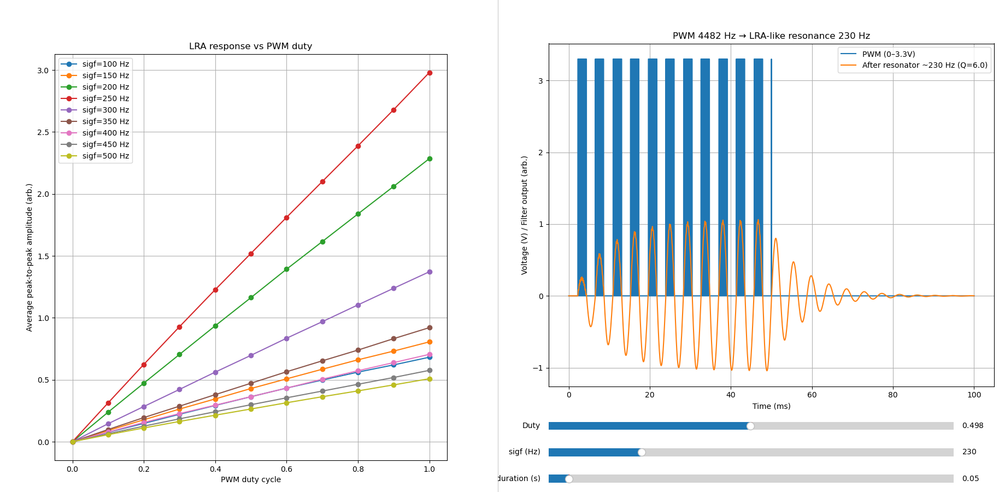
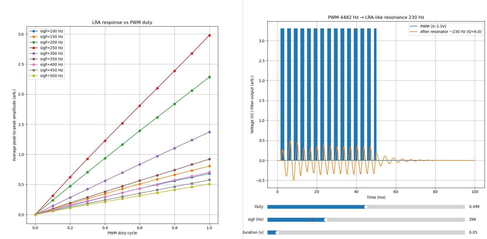
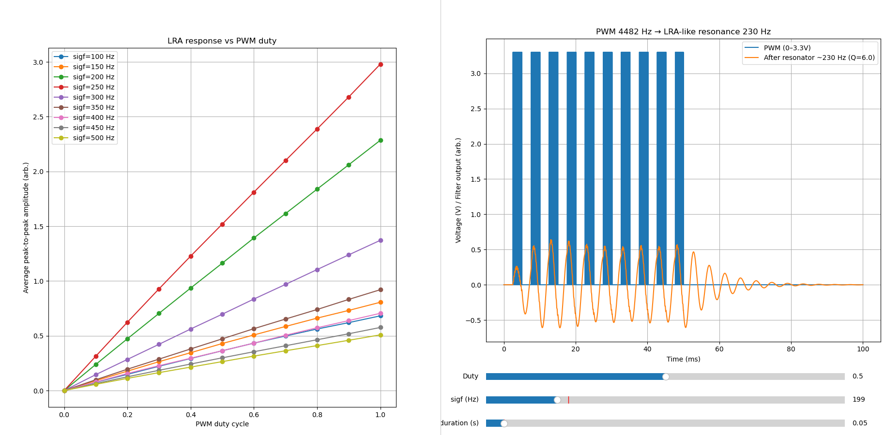

# Report

* **Date:** January 25, 2024
* **Location:** UCL
* **Participants:** Alexis, Tabitha

## Objectives

* Investigate and mitigate EEG noise caused by LRA-related EMI.
* Test actuator amplitude mapping.
* Discuss silicone moulding setup and process.

---

## Activities

### 1. EEG Noise Testing

#### Setup

* At the hospital, Tabitha set up the EEG system with electrodes immersed in a saline solution.
* The Bsense device was configured to send periodic impulses to the LRA actuators.
* Two experimental conditions were tested:

  1. LRA actuators positioned close to the EEG electrodes (≈2–3 cm), without direct contact with the saline solution.
  2. LRA actuators in direct contact with the saline solution.

#### Observations

* **Condition 1 (LRA close, no contact):**
  No visible noise was observed on the EEG signals when the LRA actuators were activated.
* **Condition 2 (LRA in contact with saline):**
  Significant noise appeared on the EEG signals during LRA activation.

#### Hypothesis

* The observed EEG noise is likely caused by direct electrical coupling between the LRA metal casing and the conductive medium (saline / body), rather than radiated EMI.

#### Actions Taken

* **Shielding:** Although shielding did not appear to be the primary issue, the LRA metal casing was connected to a grounded shielding wire as a precautionary measure.

#### Next Steps

* Test the system on-body with the shielding connection in place.
* If noise persists, electrically isolate the LRA casing from the skin using a non-conductive layer (e.g. tape).
* If insulation resolves the issue, design a dedicated non-conductive enclosure for the LRA actuators.

---

### 2. Amplitude Mapping

#### Setup

* Connected the Bsense device to a PC via serial.
* Used a Python script to sweep PWM duty cycle values sent to the LRA actuators.
* Assessed resulting vibration amplitude using a finger as a subjective proxy.

#### Observations

* Above approximately **0.5 duty cycle**, no perceptible increase in vibration amplitude was observed.

#### Actions Taken

* Documented the signal generation and amplitude mapping process (see [LRA_Signal_Generation.md](../docs/LRA_Signal_Generation.md)).
* Created a simulation of the LRA response as a function of PWM duty cycle and excitation frequency.
  The model predicts a linear relationship between duty cycle and vibration amplitude (see figures below).

| Simulation Result                          |
| ------------------------------------------ |
|  |
|  |
|  |

* Given the actuator’s **1.8 V RMS rating** and a **3.3 V supply**, maximum usable amplitude is expected around **~70% duty cycle**; beyond this, saturation is likely.
* Firmware was updated (no PC-side changes required) so that the full user-facing duty cycle range (0–100%) maps internally to **0–50% actuator duty cycle**.
* PWM frequency was increased to **46.875 kHz**.

#### Next Steps

* Validate the amplitude mapping using an objective measurement setup (test bench with accelerometer).

---

### 3. Silicone Moulding Discussion

Discussed the silicone moulding workflow for the grasping sensor with Tabitha.

#### Process

1. Mix silicone components A and B thoroughly (1:1 ratio).
2. *(Optional)* Apply a thin layer of release agent (e.g. Vaseline) to the 3D-printed mould to facilitate demoulding.
3. Pour the silicone mixture into the mould.
4. *(Optional)* Degas in a vacuum chamber to remove air bubbles introduced during mixing (recommended but not strictly required).
5. Allow to cure at room temperature for **4–6 hours**.
6. Carefully demould the cured silicone part.

#### Next Steps

* Purchase silicone: [Smooth-On Ecoflex 00-30](https://www.benam.co.uk/ecoflex-00-30).
* 3D print moulds for the sensor components.

