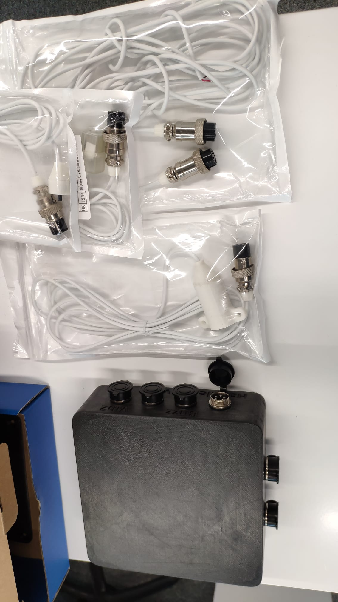

# Bsense device User Documentation

## Introduction
Bsense is a simple device to trigger audio and haptic stimulus for prenatanal studies. The device is composed of:
- An Arduino Mega 2560
- An H-brige -  L298N
- DC driver - STspin250
- 2x 9V batteries
- Accessories:
    - Pressure handle:
        - Silicone holow handle
        - Pressure sensor 
    - Buzzer - Jopto DC 3.3-5V Passive Low Level Trigger
    - Haptic stimulator v1:
        - LRA - VG0640001D
    - Haptic stimulator v2:
        - LRA - VLV101040A

# Connection
## PC - Device
The device is connected to the computer via USB. The device is powered by 2x 9V batteries.

## Device - Accessories
The device is connected to the accessories via the GX16-5 Connectors in the following way:
- **Handle**: Connected to the pressure sensor handle
- **Buzzer**: Connected to the buzzer
- **Vib1**: Currently not used
- **Vib2**: Connected to the hapic stimulator v1 or v2

## Device - Auxilliary output
The device has 2 auxilliary outputs:
- **ADC**: The pressure sensor analog output is directly connected to this connector. It can be used to monitor the pressure sensor output with an external Analog to Digital Converter. Here a plugging example picture:

- **Trigger**: The trigger output is a 5V signal that is outputed when a stimulus is given to the subject. It can be used to synchronize the device with other devices.

## Diagram

